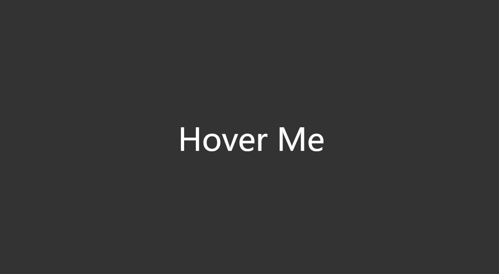

<div align="center">
  
  <h1>nijika</h1>
  <p>A collection of nice web components.</p>
</div>
<p>
  
  <a href="#" target="_blank">
    
  </a>
  <a href="https://twitter.com/alphardex007" target="_blank">
    
  </a>
</p>

> Ijichi Nijika, the Great Angel of Shimokitazawa.

## Install

```sh
npm i nijika
```

## How to use it?

nijika is based on [Web Components](https://developer.mozilla.org/en-US/docs/Web/API/Web_components), which is framework-agnostic, so that you can use it in Vanilla JS, Vue, React and so on.

First, just register the web components.

```js
import { register } from "nijika";

register();
```

Then, use them in your webpage, let's try a magnet effect.

```html
<magnet-mouse threshold="200">
  <div class="text-6xl">Hover Me</div>
</magnet-mouse>
```

Just enjoy it~



## [Examples](https://nijika.netlify.app/)

## Author

👤 **alphardex**

- Website: haobinwang-2023.netlify.app/
- Twitter: [@alphardex007](https://twitter.com/alphardex007)
- Github: [@alphardex](https://github.com/alphardex)

## Show your support

Give a ⭐️ if this project helped you!

---

_This README was generated with ❤️ by [readme-md-generator](https://github.com/kefranabg/readme-md-generator)_
